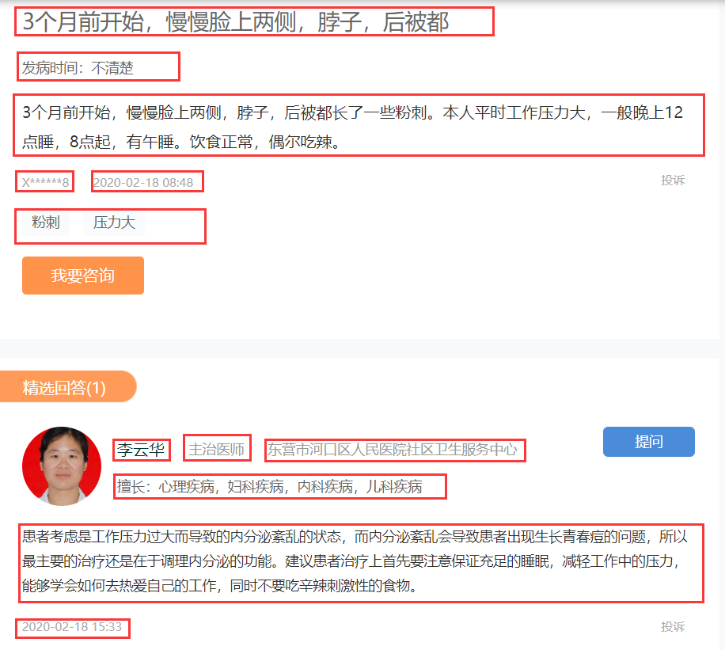

# 
Scrapy爬取39问医生网站提问信息
  
## 1.页面概览  
我们要爬取的页面为：<http://ask.39.net/news/3166-1.html>  
页面首页为包括每个疾病问题标题的列表式页面，如图  
点进去一个提问标题，查看我们需要爬取的具体信息   
需要爬取的信息都被红框标出来了。接下来就可以建立我们的项目了。  
## 2.项目建立  
- **用SCARY建立我们的项目**  
也就是在命令输入行中输入两行固定的代码`scrapy startproject name`,`scrapy genspider name allow_domain`, 这两句代码中，name和allow_domain都是需要自己设置的。  
- **在`items.py`中书写好要爬取的字段**  
这些字段用来放置我们用红框标注的那些信息。因为每个页面都是相同的结构，所以就可以为每个字段设置好它固定要爬取页面的哪个信息。  
- **在爬虫文件中书写具体逻辑**  
爬虫文件也因为命令行执行的第二个代码自动生成了，所以可以直接在`ask.py`文件中直接书写爬虫逻辑了。  
> 需要为start_urls变量赋值一个列表，列表里是爬虫最开始爬取的页面链接。这里传入的就是<http://ask.39.net/news/3166-1.html>。  
> 然后就可以在parse函数中，书写爬取这个页面的逻辑了。因为scrapy会根据start_urls自动其包含的页面发起请求，所以我们只需要处理请求后返回的响应就行了，parse函数是scrapy固定的处理响应的函数。  
> 在parse函数中我们需要做两件事，一个是发起对每个标题具体页面的请求，另一个是发起对当前页面后一页的请求。我们需要借助xpath语法找到这两个页面的链接，因为scrapy已经对xpath进行了封装，所以我们可以直接使用response.xpath()获取链接字符串。  
> 获取到链接之后，就可以使用scrapy.Request()发出请求了，第一个参数填url，第二个参数是callback也就是对前一个参数url发出请求然后获取到的response通过callback代表的函数处理。  
> 对列表页面的下一个页面链接发起的请求，其回调函数自然还是parse函数，因为parse函数刚开始就是处理列表页面的第一个页面的，自然也能处理第二个，第三个页面，直到遍历完成。  
> 对包含具体信息页面发出的请求，其回调函数还需要我们自己设计。这个回调函数负责爬取具体的信息，然后放入items字段中。现在可以先给这个回调函数取个名字叫parse_detail。  
> 在parse函数中发出的这两个页面请求都需要用yield返回，如果使用return，这个函数第一此使用程序就会停止，就不会不断遍历了。  
> 书写parse_detail函数，这个函数同parse函数一样，参数都是固定的——response。为了将爬取到的信息存入items字段，我们需要导入items.py中包含的类，然后使用同字典赋值一样的方式为其赋值，先将这个类实例化，然后就可以将这个实例化的对象看成字典了。然后还是通过xpath获取具体的字段信息。为这个字典赋完值之后，就可以yield这个字典了。这个字典之后会通过管道文件和中间件文件的处理，不过在这个项目中，我们不需要对这两个文件做额外的处理。  
## 3.运行项目，生成爬取结果文件。  
在这个项目中，我新建了一个`main.py`文件，在这个文件中我导入了`from scrapy import cmdline`，使用cmdline我们就可以不通过命令行启动scrapy项目了，而是在这个执行函数中输入跟命令行输入的相同字符就可以启动并且保存爬取结果文件了。  
这里通过-o参数就可以选择生成json文件和csv文件了，-s参数设置生成的文件使用什么编码。
因为生成的csv文件的列没有按我在`items.py`文件中书写的字段顺序从左到右排列，所以我百度了一个文件代码可以修正这个问题，也就是spiders文件夹下面的`csv_item_exporter.py`文件。